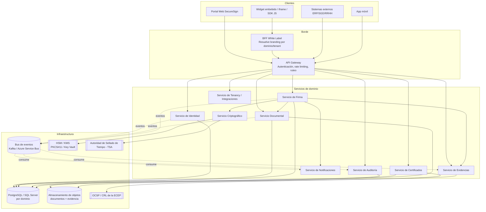

# Arquitectura General — SecureSign Perú

## 1. Principios de diseño

1. **API-first**: toda capacidad del sistema se expone primero como API REST versionada; el portal web y el SDK son clientes de esa misma API.
2. **Multi-tenant real**: aislamiento lógico por `TenantId` en cada tabla y cada evento, no solo en la capa de presentación.
3. **Zero Trust**: ningún servicio confía en otro por ubicación de red; toda llamada interna se autentica con mTLS + token de servicio.
4. **Evidencia por diseño**: cada acción relevante (visualización, intento de firma, rechazo, error) genera un evento de evidencia inmutable, no como añadido posterior.
5. **Independencia criptográfica del proveedor**: el servicio criptográfico abstrae HSM/KMS detrás de una interfaz, permitiendo Azure Key Vault, AWS KMS, HSM on-premise (PKCS#11) o un HSM certificado por INDECOPI sin reescribir el resto del sistema.
6. **Desacoplo de identidad visual (White Label)**: ningún microservicio de dominio conoce el branding; toda personalización vive en el servicio de Tenancy/Branding y se resuelve en el borde (Gateway + BFF).

## 2. Vista de contenedores (C4 - Nivel 2)

## 3. Los 10 servicios

| # | Servicio | Responsabilidad | Datos que posee |
|---|---|---|---|
| 1 | **Identidad** | Registro, autenticación, MFA, cálculo del Índice de Confianza Digital | Usuarios, factores MFA, sesiones |
| 2 | **Documental** | Ingesta, versionado, hash, almacenamiento de documentos y plantillas | Documentos, plantillas, metadatos |
| 3 | **Criptográfico** | Abstracción de HSM/KMS, firma criptográfica RSA/ECDSA, sellado de tiempo | Llaves (referencias, no material), operaciones criptográficas |
| 4 | **Firma** | Orquesta el flujo de solicitud de firma (máquina de estados), orden de firmantes, reglas de negocio | Solicitudes de firma, firmantes, flujos |
| 5 | **Auditoría** | Recolecta y sella eventos de todos los servicios en un log inmutable (hash-chain) | EventosAuditoria |
| 6 | **Notificaciones** | Envío de correo/SMS/webhooks salientes con reintentos | Plantillas de notificación, colas |
| 7 | **Evidencias** | Genera y custodia el expediente probatorio y el certificado de evidencia digital en PDF | Evidencias, certificados de evidencia |
| 8 | **Certificados** | Gestión del ciclo de vida de certificados digitales (emisión, revocación, validación OCSP/CRL) | Certificados, estado de revocación |
| 9 | **Tenancy / Integraciones** | Alta de organizaciones, credenciales API, branding White Label, cuotas | Organizaciones, ClientApps, Planes |
| 10 | **API Gateway** | Punto único de entrada, autenticación OAuth2/JWT, rate limiting, versionado | — (stateless) |

## 4. Comunicación entre servicios

- **Síncrona** (REST + gRPC interno): para operaciones que requieren respuesta inmediata (crear solicitud de firma, consultar estado).
- **Asíncrona** (bus de eventos): para todo lo que es "efecto secundario" — auditoría, notificaciones, generación de evidencia — de modo que un fallo en Notificaciones nunca bloquee una firma.
- **Contrato de eventos versionado** (`schema registry`): evita que un cambio en un servicio rompa a sus consumidores.

Eventos de dominio principales: `DocumentoRegistrado`, `SolicitudFirmaCreada`, `FirmanteNotificado`, `IdentidadValidada`, `DocumentoFirmado`, `FirmaRechazada`, `EvidenciaGenerada`, `CertificadoRevocado`.

## 5. Stack tecnológico

**Backend**
- .NET 8 / C# — Clean Architecture por servicio (Domain / Application / Infrastructure / Api)
- MediatR (CQRS interno), FluentValidation
- OAuth2 / OpenID Connect (IdentityServer / Duende o Keycloak)
- gRPC para comunicación interna de baja latencia; REST+JSON para API pública
- Bus de eventos: Apache Kafka (on-premise/AWS) o Azure Service Bus

**Frontend**
- Angular 18+ (portal administrativo — formularios complejos, tablas, RBAC) o React 18 (portal de firma — UX ligera). Se recomienda **Angular para el panel administrativo** y **React para el "widget de firma"** embebible, por tamaño de bundle.

**Datos**
- PostgreSQL como motor primario (mejor soporte JSONB para metadatos flexibles multi-tenant); SQL Server como alternativa on-premise para clientes gubernamentales que ya lo operan.
- Redis para cache y rate limiting distribuido.
- Almacenamiento de objetos S3-compatible (documentos originales, firmados y evidencia) con cifrado del lado del servidor.

**Infraestructura**
- Docker + Kubernetes (AKS/EKS o clúster on-premise para entidades públicas con requisito de soberanía de datos)
- HashiCorp Vault o Azure Key Vault para secretos de aplicación (no material criptográfico de firma, que va en HSM)
- Observabilidad: OpenTelemetry + Prometheus + Grafana + logs centralizados inmutables (ver `docs/07-seguridad`)

## 6. Despliegue on-premise vs nube

Los organismos públicos peruanos frecuentemente exigen que el material de firma y los documentos con datos personales sensibles no salgan del país o del propio centro de datos. La arquitectura soporta tres modos de despliegue sin cambio de código, mediante configuración de infraestructura:

1. **SaaS multi-tenant (nube)** — para PyMEs y planes Profesional/Empresarial.
2. **Dedicado en nube privada** — un tenant, VPC aislada, HSM dedicado (cliente gobierno/financiero).
3. **On-premise completo** — Kubernetes en el datacenter del cliente, HSM físico local, sin salida de datos a internet salvo para OCSP/TSA.

Ver [`docs/01-arquitectura/modelo-datos.md`](modelo-datos.md) para el modelo de datos y [`docs/07-seguridad/modelo-seguridad.md`](../07-seguridad/modelo-seguridad.md) para el detalle de seguridad.
