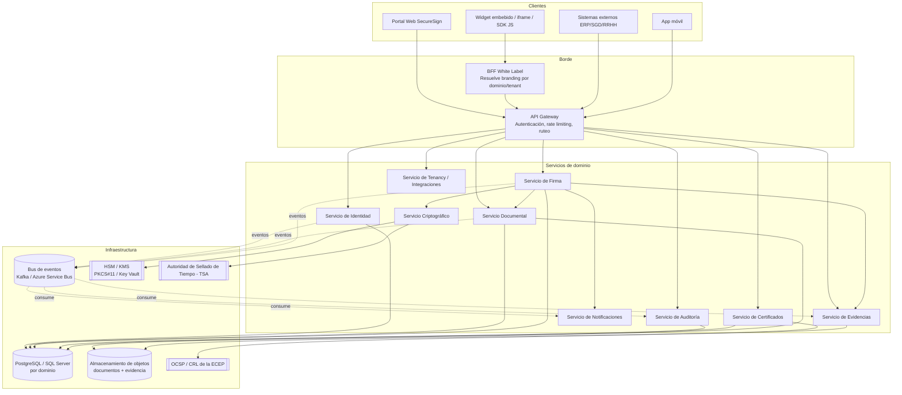

# Arquitectura General — SecureSign Perú

> **Este documento describe la arquitectura OBJETIVO** (visión completa, multi-tenant, on-premise/nube, 10 servicios) — no el estado actual del código. Para lo que REALMENTE está construido, probado y verificado hoy, ver `src/backend/README.md` (tabla de honestidad) y `src/backend/RUNBOOK.md` (cada fase ejecutada), o `docs/08-cumplimiento/matriz-cumplimiento-indecopi.md` (que sí refleja el estado real, auditado contra el código). Las secciones 1, 3 y 4 (principios, servicios, comunicación) se auditaron contra el código el 2026-09-16 — ver las notas `[objetivo]` en esas secciones para lo que NO está construido. Las secciones 5 (stack) en adelante mezclan piezas verificadas (marcadas) con diseño de infraestructura a futuro (Kubernetes, Redis, Vault, frontend Angular/React, despliegue on-premise) que no se auditó exhaustivamente aquí — tratar como plan, no como inventario del código actual.

## 1. Principios de diseño

1. **API-first** `[objetivo — hoy sin versionado]`: toda capacidad del sistema se expone primero como API REST; el portal web y el SDK son clientes de esa misma API. Hoy las rutas reales no llevan prefijo `/v1` ni ninguna versión — ver `docs/05-integracion/manual-integracion-api.md`.
2. **Multi-tenant real**: aislamiento lógico por `TenantId` en cada tabla y cada evento — esta parte SÍ está implementada hoy (`TenantContext` derivado únicamente de claims JWT firmados, nunca del cuerpo de la petición, propagado a través de ~90 archivos de todos los servicios de dominio).
3. **Zero Trust** `[objetivo — hoy solo la mitad]`: ningún servicio confía en otro por ubicación de red. Hoy cada llamada interna SÍ lleva un token de servicio (JWT de intercambio, RFC 8693, RUNBOOK.md 12.21) — pero **no hay mTLS**: el tráfico entre contenedores es HTTP plano (ver `docker-compose.yml`). La autenticación por token es real; el transporte cifrado/mutuamente autenticado entre servicios, no.
4. **Evidencia por diseño**: cada acción relevante genera un evento de evidencia inmutable — implementado (`EventoEvidencia`, cadena de hashes real, `SecureSign.Evidence`).
5. **Independencia criptográfica del proveedor**: la interfaz (`IProveedorCriptografico`) sí abstrae el proveedor — hoy existen dos implementaciones reales, una de software (desarrollo/pruebas, llave en memoria del proceso) y una PKCS#11 (verificada contra un DNIe físico real, RUNBOOK.md sección 10). Azure Key Vault/AWS KMS no están implementados, pero el diseño no los bloquea.
6. **Desacoplo de identidad visual (White Label)** `[objetivo — apenas iniciado]`: solo el aislamiento por `TenantId` está implementado hoy. No existe todavía un BFF, resolución de dominio/branding, ni el servicio de Tenancy — ver `docs/06-white-label/arquitectura-white-label.md` para el detalle de qué falta.

## 2. Vista de contenedores (C4 - Nivel 2)

## 3. Los 10 servicios

Estado real vs. objetivo (auditado contra el código el 2026-09-16): de los 10, **7 están construidos y verificados hoy**; 3 no existen todavía como servicios (su alcance lo cubre configuración estática o simplemente no está hecho).

| # | Servicio | Responsabilidad | Datos que posee | Estado real |
|---|---|---|---|---|
| 1 | **Identidad** | Registro, autenticación, MFA, cálculo del Índice de Confianza Digital | Usuarios, factores MFA, sesiones | 🟡 Implementado, pero más simple: sin MFA, sin registro de usuarios propio — solo flags de confianza (`UsuarioIdentidad`) e Índice calculado al vuelo, nunca persistido |
| 2 | **Documental** | Ingesta, versionado, hash, almacenamiento de documentos y plantillas | Documentos, plantillas, metadatos | 🟢 Implementado (sin plantillas todavía) |
| 3 | **Criptográfico** | Abstracción de HSM/KMS, firma criptográfica RSA/ECDSA, sellado de tiempo | Llaves (referencias, no material), operaciones criptográficas | 🟢 Implementado (software + PKCS#11 real) |
| 4 | **Firma** | Orquesta el flujo de solicitud de firma (máquina de estados), orden de firmantes, reglas de negocio | Solicitudes de firma, firmantes, flujos | 🟢 Implementado |
| 5 | **Auditoría** | Registro técnico/de seguridad append-only (**no** es un hash-chain — esa es una capacidad de Evidencias, no de Auditoría, ver `docs/01-arquitectura/modelo-datos.md`) | EventosAuditoria | 🟢 Implementado (RUNBOOK.md 12.16) |
| 6 | **Notificaciones** | Envío de correo/SMS/webhooks salientes con reintentos | Plantillas de notificación, colas | 🔴 No existe — ningún envío de correo/SMS/webhook está implementado |
| 7 | **Evidencias** | Genera y custodia el expediente probatorio (cadena de hashes real) | Evidencias, certificados de evidencia | 🟢 Implementado |
| 8 | **Certificados** | Gestión del ciclo de vida de certificados digitales | Certificados, estado de revocación | 🔴 No existe como servicio propio — la validación de certificados (vigencia, cadena, TSL, OCSP/CRL) vive dentro de `SecureSign.Trust`, una librería compartida, no un servicio con su propia base de datos |
| 9 | **Tenancy / Integraciones** | Alta de organizaciones, credenciales API, branding White Label, cuotas | Organizaciones, ClientApps, Planes | 🔴 No existe — hoy es un catálogo estático (`ClientesDemo` en configuración del Gateway), con su propio comentario en el código señalando que reemplaza a este "futuro Servicio de Tenancy/Integraciones" |
| 10 | **API Gateway** | Punto único de entrada, autenticación OAuth2/JWT, ruteo | — (stateless) | 🟡 Implementado (RS256, JWKS, RUNBOOK.md 12.21), sin rate limiting ni versionado |

## 4. Comunicación entre servicios `[objetivo]`

Diseño objetivo (bus de eventos, gRPC) — **la realidad de hoy es más simple**: toda comunicación entre servicios es síncrona, HTTP/REST + JSON, autenticada con un token de intercambio JWT de alcance interno (RFC 8693, `TokenExchangeService`, RUNBOOK.md 12.21). No hay gRPC, no hay bus de eventos (ni Kafka ni Azure Service Bus — cero referencias en el código), y no hay `schema registry`. Los eventos de dominio (`DomainEvents`) sí se levantan en memoria dentro de cada agregado, pero **nunca se publican** — quedan acumulados en la entidad sin ningún consumidor, una pieza explícitamente pendiente (ver `src/backend/README.md`).

- **Síncrona** (REST + gRPC interno) `[objetivo — hoy solo REST]`: para operaciones que requieren respuesta inmediata (crear solicitud de firma, consultar estado).
- **Asíncrona** (bus de eventos) `[objetivo — no implementado]`: para todo lo que es "efecto secundario" — auditoría, notificaciones, generación de evidencia. Hoy, donde este patrón importa (evidencia, auditoría), se hace con una llamada HTTP síncrona directa desde el handler que la origina, no con un bus.
- **Contrato de eventos versionado** (`schema registry`) `[objetivo — no implementado]`.

Eventos de dominio principales (diseño objetivo, no publicados todavía): `DocumentoRegistrado`, `SolicitudFirmaCreada`, `FirmanteNotificado`, `IdentidadValidada`, `DocumentoFirmado`, `FirmaRechazada`, `EvidenciaGenerada`, `CertificadoRevocado`.

## 5. Stack tecnológico

**Backend**
- .NET 8 / C# — Clean Architecture por servicio (Domain / Application / Infrastructure / Api) — **implementado, verificado**.
- MediatR (CQRS interno), FluentValidation — **implementado**.
- OAuth2 / OpenID Connect (IdentityServer / Duende o Keycloak) `[objetivo]` — hoy es un STS mínimo propio (Gateway como único firmante RS256, JWKS publicado, RUNBOOK.md 12.21), no un IdP acreditado externo; ningún flujo de IdentityServer/Duende/Keycloak está en uso. Solo `client_credentials` (B2B); no hay Authorization Code/PKCE para usuarios humanos.
- gRPC para comunicación interna de baja latencia `[objetivo — no implementado]`; REST+JSON para API pública — **esto sí, es lo único que se usa hoy, también internamente**.
- Bus de eventos: Apache Kafka (on-premise/AWS) o Azure Service Bus `[objetivo — no implementado]`.

**Frontend**
- Angular 18+ (portal administrativo — formularios complejos, tablas, RBAC) o React 18 (portal de firma — UX ligera). Se recomienda **Angular para el panel administrativo** y **React para el "widget de firma"** embebible, por tamaño de bundle.

**Datos**
- PostgreSQL como motor primario (mejor soporte JSONB para metadatos flexibles multi-tenant); SQL Server como alternativa on-premise para clientes gubernamentales que ya lo operan.
- Redis para cache y rate limiting distribuido.
- Almacenamiento de objetos S3-compatible (documentos originales, firmados y evidencia) con cifrado del lado del servidor.

**Infraestructura**
- Docker + Kubernetes (AKS/EKS o clúster on-premise para entidades públicas con requisito de soberanía de datos)
- HashiCorp Vault o Azure Key Vault para secretos de aplicación (no material criptográfico de firma, que va en HSM)
- Observabilidad: OpenTelemetry + Prometheus + Grafana + logs centralizados inmutables (ver `docs/07-seguridad`)

## 6. Despliegue on-premise vs nube

Los organismos públicos peruanos frecuentemente exigen que el material de firma y los documentos con datos personales sensibles no salgan del país o del propio centro de datos. La arquitectura soporta tres modos de despliegue sin cambio de código, mediante configuración de infraestructura:

1. **SaaS multi-tenant (nube)** — para PyMEs y planes Profesional/Empresarial.
2. **Dedicado en nube privada** — un tenant, VPC aislada, HSM dedicado (cliente gobierno/financiero).
3. **On-premise completo** — Kubernetes en el datacenter del cliente, HSM físico local, sin salida de datos a internet salvo para OCSP/TSA.

Ver [`docs/01-arquitectura/modelo-datos.md`](modelo-datos.md) para el modelo de datos y [`docs/07-seguridad/modelo-seguridad.md`](../07-seguridad/modelo-seguridad.md) para el detalle de seguridad.
