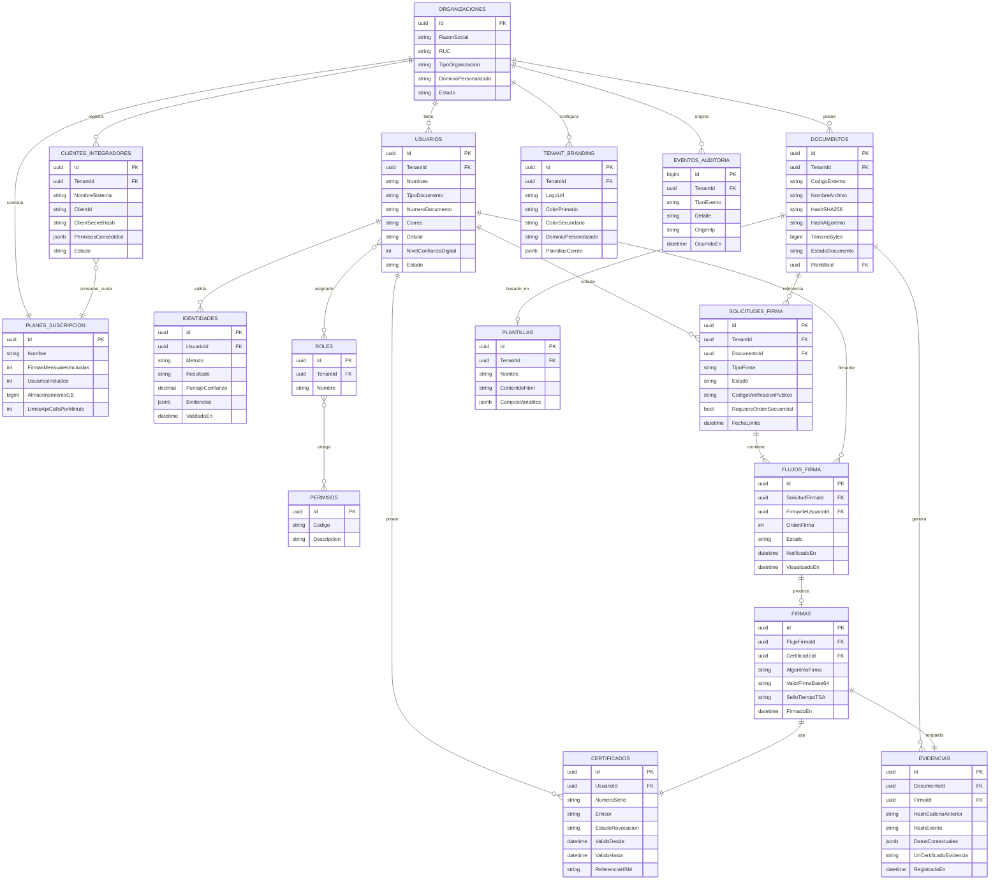

# Modelo de Datos — SecureSign Perú

> **Este es el modelo de datos OBJETIVO/de referencia** (igual que `database/schema.sql`, ver `README.md` del backend) — no es necesariamente el esquema que corre hoy. La implementación real es EF Core Code-First (migraciones en `Persistence/Migrations/` de cada servicio), con su propio esquema generado a partir de las entidades C#, no de este diagrama. Ver "Diferencias conocidas con la implementación real" al final de este documento para los puntos donde ambos divergen — auditado contra el código el 2026-09-16.

Todas las tablas de dominio (excepto catálogos globales) incluyen `TenantId` (organización) para aislamiento multi-tenant, y las columnas de auditoría `CreadoEn`, `CreadoPor`, `ActualizadoEn`, `ActualizadoPor`.

## Diagrama entidad-relación (núcleo)

## Notas de diseño relevantes

- **El hash-chain vive en `EVIDENCIAS`, NO en `EVENTOS_AUDITORIA`** — corrección deliberada de una versión anterior de este documento, que describía el hash-chain en la tabla equivocada. En la implementación real (`SecureSign.Audit.Domain.EventoAuditoria`, RUNBOOK.md 12.16), `EVENTOS_AUDITORIA` es intencionalmente un log append-only SIN cadena de hashes — un registro técnico/de seguridad simple (tipo de evento, detalle, IP, tenant, fecha), separado a propósito de `EVIDENCIAS` (`EventoEvidencia`), que sí es la cadena de hashes real (`HashEvento`/`HashEventoAnterior`) para la trazabilidad legal de un documento/firma concreto. Mezclar ambos conceptos fue exactamente el error que el informe de preauditoría pidió corregir ("evidencia de negocio, auditoría técnica y registro de validación criptográfica... son conceptos relacionados, pero no equivalentes") — este documento, antes de esta corrección, seguía mezclándolos.
- **`SOLICITUDES_FIRMA.CodigoVerificacionPublico`** es el código corto que el portal `verificar.securesign.pe` resuelve, y **nunca** expone el `Id` interno (UUID) para evitar enumeración.
- **`CERTIFICADOS.ReferenciaHSM`** almacena solo una referencia opaca (alias/handle) a la llave dentro del HSM/KMS — el material privado nunca sale de ese límite de confianza ni se persiste en la base de datos aplicativa. **En la implementación real de hoy, esto es el objetivo, no la garantía por defecto**: `SecureSign.Crypto` tiene un proveedor de software (`ProveedorCriptograficoSoftware`) que SÍ mantiene llaves privadas en memoria del proceso, explícitamente marcado en su propio comentario como solo para desarrollo/pruebas — el proveedor pensado para producción (`ProveedorCriptograficoPkcs11`, verificado contra un DNIe real, RUNBOOK.md sección 10) es el que cumple esta garantía. Cuál se usa es una decisión de configuración/despliegue, no algo que el código imponga.
- **Particionamiento**: `EVENTOS_AUDITORIA` y `EVIDENCIAS` se particionan por `TenantId` + rango mensual para permitir purgas de retención por cliente sin bloquear el resto de la plataforma.

## Diferencias conocidas con la implementación real

La implementación real (EF Core Code-First) es deliberadamente más simple que este diagrama de referencia en varios puntos — auditado contra el código el 2026-09-16:

| Este diagrama | Implementación real |
|---|---|
| `FIRMAS` (tabla propia: algoritmo, valor de firma, sello TSA, `CertificadoId`) | No existe como entidad separada. El equivalente real es `FlujoFirma` (`SecureSign.Signature.Domain`) — estado, fechas, `TokenAccesoUnico`, posición de firma. No guarda el algoritmo ni el valor de la firma como columnas propias. |
| `CERTIFICADOS` (tabla propia con `ReferenciaHSM`, estado de revocación) | No existe. `SecureSign.Crypto` no tiene persistencia propia (es una abstracción sobre el proveedor criptográfico activo, sin base de datos). |
| `USUARIOS.NivelConfianzaDigital` (columna persistida) + `IDENTIDADES` (histórico por método de validación) | El Índice de Confianza Digital se **calcula al vuelo** (`IndiceConfianzaDigital.Calcular()`), nunca se persiste como columna. `UsuarioIdentidad` (`SecureSign.Identity.Domain`) guarda solo flags booleanos agregados (`TieneValidacionExitosa`, `TieneCertificadoVigente`, `EsCuentaInstitucional`) y un contador de rechazos — no una tabla `IDENTIDADES` con un registro por intento/método, decisión de simplificación documentada explícitamente en el propio código. |
| `SOLICITUDES_FIRMA.OrdenSecuencial` (`int`) | El campo real es `RequiereOrdenSecuencial` (`bool`) — un flag, no un número de secuencia. El orden real por firmante vive en `FLUJOS_FIRMA.OrdenFirma`, que este diagrama ya modela por separado correctamente. |
| `ROLES`/`PERMISOS`/`RolPermisos` (RBAC granular) | No implementado todavía — ver la misma limitación en `docs/07-seguridad/modelo-seguridad.md`. |
| `TENANT_BRANDING`, `CLIENTES_INTEGRADORES` con `PermisosConcedidos` | Diseño objetivo del módulo White Label — ver `docs/06-white-label/arquitectura-white-label.md` para el estado real (mínimo: solo aislamiento por `TenantId` está implementado hoy). |

Estas diferencias no son errores de la implementación — son simplificaciones deliberadas documentadas en el propio código (ver comentarios de clase en `EventoAuditoria.cs`, `UsuarioIdentidad.cs`). El diagrama de arriba sigue siendo útil como diseño de referencia hacia el que evolucionar si el negocio lo pide, no como descripción del esquema que corre hoy.
