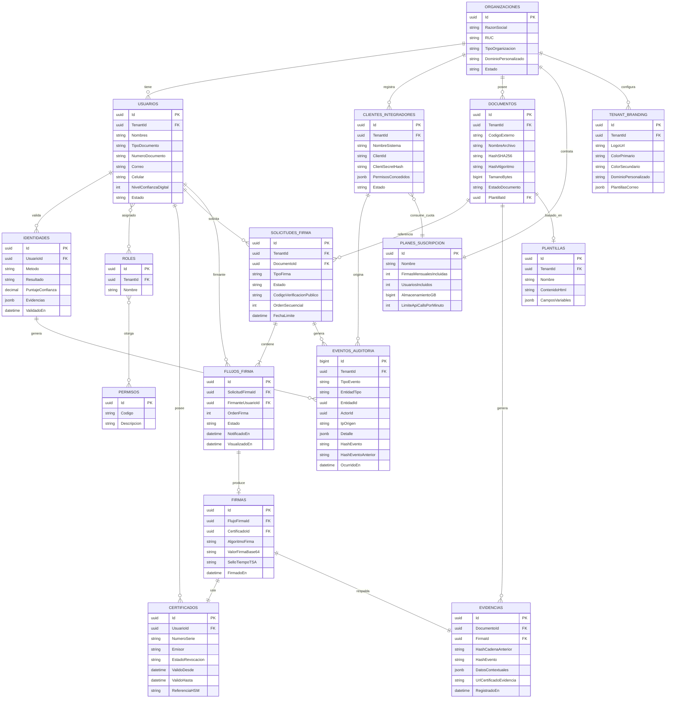

# Modelo de Datos — SecureSign Perú

Todas las tablas de dominio (excepto catálogos globales) incluyen `TenantId` (organización) para aislamiento multi-tenant, y las columnas de auditoría `CreadoEn`, `CreadoPor`, `ActualizadoEn`, `ActualizadoPor`.

## Diagrama entidad-relación (núcleo)

## Notas de diseño relevantes

- **`EVENTOS_AUDITORIA` es un hash-chain**: cada fila almacena `HashEventoAnterior` (el hash del evento previo del mismo tenant) y `HashEvento` (hash de sus propios datos + el anterior). Esto convierte la tabla en un log append-only verificable sin necesidad de blockchain pública — ver innovación #4 en [`docs/02-innovacion-patente`](../02-innovacion-patente/analisis-innovaciones.md).
- **`SOLICITUDES_FIRMA.CodigoVerificacionPublico`** es el código corto que el portal `verificar.securesign.pe` resuelve, y **nunca** expone el `Id` interno (UUID) para evitar enumeración.
- **`CERTIFICADOS.ReferenciaHSM`** almacena solo una referencia opaca (alias/handle) a la llave dentro del HSM/KMS — el material privado nunca sale de ese límite de confianza ni se persiste en la base de datos aplicativa.
- **Particionamiento**: `EVENTOS_AUDITORIA` y `EVIDENCIAS` se particionan por `TenantId` + rango mensual para permitir purgas de retención por cliente sin bloquear el resto de la plataforma.
