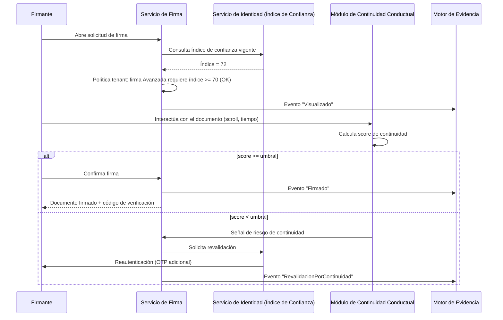

# Documento Técnico Preliminar para Solicitud de Patente

**Sistema y método para firma electrónica con evidencia digital verificable, confianza dinámica del firmante e integridad conductual**

> Borrador de trabajo para uso interno y como insumo para un agente de la propiedad industrial registrado ante INDECOPI. No constituye una solicitud formal. Formato orientativo según los requisitos del Decreto Legislativo N° 1075 (art. 26 y siguientes) y su reglamento.

---

## 1. Título de la invención

"Sistema y método implementado por computador para la generación de evidencia digital verificable mediante encadenamiento criptográfico contextual, cálculo dinámico de un índice de confianza del firmante, y detección de continuidad conductual durante procesos de firma electrónica"

## 2. Campo técnico

La invención pertenece al campo de la seguridad informática y las infraestructuras de clave pública (PKI), específicamente a los sistemas de firma electrónica y firma digital, y más particularmente a los métodos de generación de evidencia probatoria digital y evaluación de riesgo de identidad en procesos de firma de documentos electrónicos.

## 3. Resumen

Se describe un sistema y método que combina tres mecanismos técnicos interrelacionados: (a) un motor de generación de evidencia digital que encadena criptográficamente los eventos del ciclo de vida de un documento mediante funciones hash con referencia al evento inmediatamente anterior dentro del mismo espacio lógico (tenant), permitiendo verificación de integridad sin dependencia de una autoridad central única; (b) un módulo de cálculo dinámico de un índice de confianza del firmante, actualizado en tiempo real a partir de señales de validación de identidad, que determina de forma automática qué clase de firma electrónica (simple, avanzada o digital, según la clasificación legal aplicable) puede ejecutar un usuario para una operación específica; y (c) un módulo de análisis de continuidad conductual que captura métricas de interacción no invasivas durante la sesión de firma para detectar posible secuestro de sesión posterior a la validación inicial de identidad, generando una señal adicional que se incorpora como evidencia y puede activar una re-autenticación condicional.

## 4. Problema técnico

Los sistemas de firma electrónica conocidos presentan tres limitaciones técnicas concurrentes que la invención resuelve de forma integrada:

1. La evidencia de auditoría se almacena típicamente como registros independientes en bases de datos relacionales convencionales, susceptibles de alteración por un actor con privilegios administrativos, debilitando su valor probatorio.
2. La determinación de qué tipo de firma electrónica puede utilizar un usuario se establece habitualmente de forma estática (por configuración manual o por posesión binaria de un certificado), sin reflejar el nivel de riesgo real y actual de la identidad del firmante.
3. La validación de identidad ocurre en un instante puntual del proceso (p. ej., un OTP o una verificación biométrica al inicio), sin mecanismo técnico que detecte si el control del dispositivo o sesión cambia de manos entre la validación y el acto de firma.

## 5. Estado de la técnica

Las plataformas comerciales conocidas (a título de referencia técnica, sin limitarse a ellas) generan certificados de finalización estáticos al término del proceso de firma, basados en registros de auditoría convencionales no encadenados criptográficamente entre sí de forma verificable por terceros. La determinación del tipo de firma habilitado suele configurarse de forma manual por el administrador del sistema o depender exclusivamente de la posesión de un certificado digital, sin un índice continuo recalculado dinámicamente. No se ha identificado, en la revisión preliminar, una solución que combine encadenamiento criptográfico contextual de evidencia, un índice de confianza dinámico que determina la clase de firma permitida por operación, y análisis de continuidad conductual como mecanismo unificado e interdependiente.

## 6. Descripción detallada de la invención

### 6.1 Motor de evidencia por encadenamiento contextual

Cada evento relevante del ciclo de vida de un documento (registro, notificación, visualización, inicio de validación de identidad, resultado de validación, aplicación de firma, rechazo) es procesado por un componente de evidencia que calcula:

```
HashEvento(n) = H( Datos(n) || HashEvento(n-1) || SelloTiempo(n) )
```

donde `H` es una función hash criptográfica (SHA-256 o superior), `Datos(n)` son los atributos normalizados del evento actual, `HashEvento(n-1)` es el hash del evento inmediatamente anterior dentro del mismo espacio lógico aislado (tenant), y `SelloTiempo(n)` es un valor de tiempo obtenido de una fuente confiable. Periódicamente, un componente agregador calcula una raíz de árbol de Merkle sobre un lote de `HashEvento` y solicita un sello de tiempo cualificado (conforme a RFC 3161) sobre dicha raíz, reduciendo el costo de sellado individual sin perder la capacidad de verificar cualquier evento individual mediante la prueba de inclusión correspondiente (Merkle proof).

### 6.2 Índice de confianza dinámico del firmante

Un componente de identidad mantiene, para cada usuario, un valor numérico (0-100) recalculado ante cada señal relevante (validación OTP, validación biométrica, emisión o revocación de certificado, historial de rechazos). Un componente de políticas, configurable por organización, define una función de mapeo entre rangos del índice y las clases de firma electrónica habilitadas para una operación específica, de manera que la misma persona pueda estar habilitada para firma simple en un rango de índice y requerir un incremento de dicho índice (mediante validación adicional) para ejecutar una firma digital sobre un documento de mayor criticidad, evaluado en el momento de la solicitud y no de forma estática al momento del registro del usuario.

### 6.3 Análisis de continuidad conductual

Un componente cliente captura, durante la ventana temporal entre la validación de identidad y la confirmación del acto de firma, un conjunto de métricas de interacción (cadencia de desplazamiento del documento, tiempo de permanencia por sección, patrones temporales de los eventos de puntero/táctiles) sin capturar contenido semántico de dichas interacciones. Un componente de análisis calcula un score de continuidad comparando dichas métricas contra un modelo de referencia de interacción humana plausible para el tipo de documento, de forma que una aceptación incompatible con una lectura humana razonable (p. ej., confirmación inmediata sin desplazamiento en un documento extenso) reduce el score y puede activar, según política del tenant, una re-autenticación antes de permitir la transición de estado a "firmado".

### 6.4 Interdependencia de los tres componentes

El score de continuidad conductual (6.3) se incorpora como un evento adicional en el motor de evidencia (6.1), y una caída relevante de dicho score puede exigir, mediante el componente de políticas, una revalidación que a su vez recalcula el índice de confianza dinámico (6.2) antes de permitir que la máquina de estados de firma continúe. Esta interdependencia técnica —no la mera coexistencia de los tres módulos— constituye el núcleo de la invención.

## 7. Reivindicaciones propuestas (borrador, sujeto a revisión por agente de propiedad industrial)

1. Un método implementado por computador para generar evidencia digital verificable de un proceso de firma electrónica, que comprende: recibir una pluralidad de eventos asociados al ciclo de vida de un documento electrónico dentro de un espacio lógico aislado; calcular, para cada evento, un valor hash que incorpora los datos del evento, el valor hash del evento inmediatamente anterior dentro del mismo espacio lógico, y un sello de tiempo; y agregar periódicamente un subconjunto de dichos valores hash mediante una estructura de árbol de Merkle para su sellado de tiempo cualificado conjunto.

2. El método de la reivindicación 1, que comprende además calcular un índice de confianza numérico asociado a un firmante, actualizado en respuesta a señales de validación de identidad recibidas, y determinar, a partir de dicho índice y de una política configurable, la clase de firma electrónica habilitada para una operación de firma específica solicitada por dicho firmante.

3. El método de la reivindicación 2, que comprende además capturar, durante una sesión de firma y con posterioridad a una validación de identidad inicial, un conjunto de métricas de interacción del usuario con el documento; calcular un score de continuidad conductual a partir de dichas métricas; y, cuando dicho score sea inferior a un umbral configurable, generar un evento adicional en el motor de evidencia de la reivindicación 1 y condicionar la transición de estado del proceso de firma a una revalidación que recalcula el índice de confianza de la reivindicación 2.

4. Un sistema que comprende los medios técnicos para ejecutar el método de cualquiera de las reivindicaciones 1 a 3, incluyendo al menos un módulo de evidencia, un módulo de identidad y confianza dinámica, y un módulo de análisis de continuidad conductual, interconectados de forma que la salida de cada módulo constituye una entrada condicionante para al menos otro de dichos módulos.

5. El sistema de la reivindicación 4, en el que el módulo de evidencia opera de forma aislada por organización (multi-tenant) sin exponer el contenido de eventos de una organización a otra, preservando al mismo tiempo la verificabilidad pública del compromiso agregado mediante la prueba de inclusión de Merkle.

*(Las reivindicaciones definitivas deben ser redactadas y validadas por un agente de la propiedad industrial tras la búsqueda de anterioridad formal.)*

## 8. Ventajas técnicas

- Verificabilidad de la integridad de cualquier evento individual sin depender de la confianza en el propio operador de la plataforma.
- Reducción del costo y la latencia de sellado de tiempo cualificado frente a sellar cada evento de forma individual.
- Adecuación automática y en tiempo real del nivel de firma exigido al riesgo real de la operación, en lugar de una configuración estática.
- Detección de una clase de fraude (secuestro de sesión post-validación) no cubierta por los controles de identidad puntual empleados por las soluciones conocidas.

## 9. Figuras / dibujos técnicos sugeridos

- **Figura 1**: diagrama de bloques del sistema (módulo de evidencia, módulo de identidad/confianza, módulo de continuidad conductual, máquina de estados de firma) — ver [`docs/01-arquitectura/arquitectura-general.md`](../01-arquitectura/arquitectura-general.md) sección 2.
- **Figura 2**: diagrama de secuencia del flujo de firma con los puntos de interacción de los tres módulos — ver sección 10 más abajo.
- **Figura 3**: estructura de la cadena de hashes y el árbol de Merkle de agregación periódica.

## 10. Flujo técnico (diagrama de secuencia)



## 11. Documentos relacionados

- Análisis completo de las 8 innovaciones evaluadas: [`analisis-innovaciones.md`](analisis-innovaciones.md)
- Modelo de datos que soporta el hash-chain (`Evidencias`, `EventosAuditoria`): [`../01-arquitectura/modelo-datos.md`](../01-arquitectura/modelo-datos.md)
- Implementación de referencia del motor de evidencia: [`../../src/backend/src/Services/SecureSign.Evidence`](../../src/backend/src/Services/SecureSign.Evidence)
