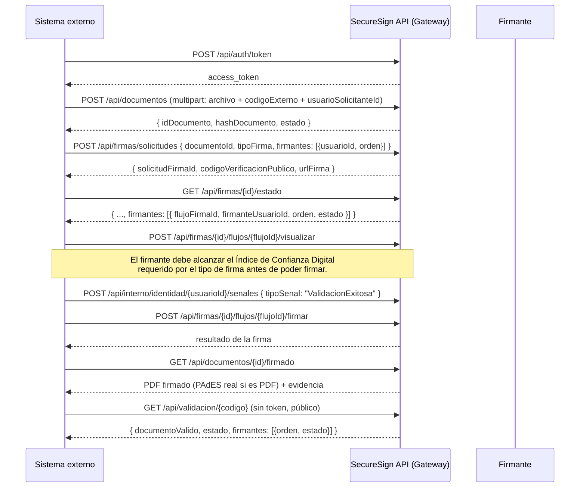

# Manual de Integración — SecureSign API

> **Reescrito el 2026-09-16 contra la API real** (auditado contra `src/backend/src/Gateway`, `src/backend/src/Services/*/Controllers`, y el ejemplo funcional `src/backend/ejemplos-integracion/firmar-documento.sh`). La versión anterior de este manual describía una API distinta — con versionado `/v1`, sandbox, portal de desarrolladores, `X-Api-Key`, shapes de request/response diferentes, y una sección de webhooks completa — que no corresponde a nada implementado. Lo marcado `[roadmap]` abajo es la intención de la versión anterior, no construida todavía; todo lo demás es real y probado (script de ejemplo funcionando de punta a punta contra el stack Docker real).

## Capítulo 1 — Introducción

SecureSign expone su funcionalidad como una API REST vía un Gateway único. Este manual está dirigido a equipos técnicos de sistemas ERP, de Gestión Documental (SGD), RRHH, judiciales, educativos o financieros que deseen incorporar firma electrónica/digital.

**Objetivo**: que un desarrollador integre el flujo completo (autenticación → registro de documento → solicitud de firma → visualización → validación de identidad → firma → descarga → validación pública) siguiendo el script de ejemplo funcional, `src/backend/ejemplos-integracion/firmar-documento.sh`, que es la fuente de verdad más confiable de este manual — se ejecuta contra el stack Docker real, no es pseudocódigo.

## Capítulo 2 — Requisitos técnicos

- **URL base**: la del Gateway — `http://localhost:8080` en un despliegue Docker local (`docker-compose.yml`), o la URL real del Gateway en el entorno donde se despliegue. **No hay versionado de rutas** (`/v1`) — todas las rutas son `/api/...` directamente. `[roadmap]` No existe un sandbox público (`sandbox-api.securesign.pe`) ni un portal de desarrolladores — hoy se integra contra el stack Docker levantado localmente o el entorno que el operador de SecureSign despliegue.
- **Certificados**: TLS depende del despliegue (el Gateway en sí no fuerza HTTPS en desarrollo). En producción, terminar TLS delante del Gateway (reverse proxy/load balancer).
- **Seguridad de red** `[roadmap]`: no existe hoy ninguna allowlist de IP configurable por cliente integrador.

## Capítulo 3 — Autenticación

### OAuth2 (Client Credentials) — único flujo soportado

```http
POST /api/auth/token
Content-Type: application/x-www-form-urlencoded

grant_type=client_credentials&client_id={ClientId}&client_secret={ClientSecret}
```

Respuesta:
```json
{
  "access_token": "eyJhbGciOiJSUzI1NiIsImtpZCI6...",
  "token_type": "Bearer",
  "expires_in": 3600,
  "scope": "documentos.crear documentos.leer firmas.crear firmas.leer evidencias.leer identidad.gestionar"
}
```

`client_id`/`client_secret` los asigna el operador de SecureSign por integrador (catálogo de clientes en la configuración del Gateway) — no hay autoservicio de alta hoy.

### JWT

El `access_token` es un JWT firmado con RS256 por el Gateway (único firmante de la plataforma; llave privada nunca sale de ahí — RUNBOOK.md 12.21). Todos los endpoints de negocio requieren `Authorization: Bearer {access_token}`.

### API Keys `[roadmap — no implementado]`

No existe soporte para `X-Api-Key` en ningún endpoint. Toda llamada autenticada usa el `access_token` OAuth2.

> **Nunca** exponer `client_secret` en código de frontend/móvil. La autenticación OAuth2 debe ejecutarse siempre desde el backend del sistema integrador.

## Capítulo 4 — Flujo completo de integración

Este es el flujo REAL (más pasos que un resumen de alto nivel, porque varios de ellos son gates de seguridad reales, no opcionales):



`[roadmap]` No hay webhooks — el sistema integrador debe hacer *polling* de `GET /api/firmas/{id}/estado` para saber cuándo un documento quedó firmado.

## Capítulo 5 — Catálogo de API

### 5.1 Registrar documento

```http
POST /api/documentos
Authorization: Bearer {token}
Content-Type: multipart/form-data

archivo: contrato.pdf
codigoExterno: "EXP-2026-00123"
usuarioSolicitanteId: "33333333-3333-3333-3333-333333333333"
```

No hay campo `metadata` — cualquier dato adicional se guarda en el sistema integrador, no en SecureSign.

Respuesta `201 Created`:
```json
{ "idDocumento": "b3f1...", "hashDocumento": "a94a8fe5...", "estado": "Registrado" }
```

### 5.2 Crear solicitud de firma

```http
POST /api/firmas/solicitudes
Authorization: Bearer {token}
Content-Type: application/json

{
  "documentoId": "b3f1...",
  "tipoFirma": "Avanzada",
  "requiereOrdenSecuencial": false,
  "firmantes": [
    { "usuarioId": "44444444-4444-4444-4444-444444444444", "orden": 1 }
  ],
  "fechaLimite": null
}
```

`firmantes` referencia usuarios que ya existen en SecureSign por `usuarioId` (GUID) — **no** se envían nombre, documento de identidad ni correo en esta llamada; esos datos, si SecureSign los necesita, se resuelven por el `usuarioId` en el Servicio de Identidad.

Respuesta `201 Created`:
```json
{ "solicitudFirmaId": "9c2e...", "codigoVerificacionPublico": "K3PQ7X2A1F", "urlFirma": "https://firma.securesign.pe/t/.../f/..." }
```

### 5.3 Consultar estado

```http
GET /api/firmas/{id}/estado
```
```json
{
  "solicitudFirmaId": "9c2e...",
  "documentoId": "b3f1...",
  "estado": "Firmado",
  "codigoVerificacionPublico": "K3PQ7X2A1F",
  "firmantes": [
    { "flujoFirmaId": "a1b2...", "firmanteUsuarioId": "4444...", "orden": 1, "estado": "Firmado" }
  ]
}
```
Ningún firmante trae `nombre` — el Servicio de Firma no lo almacena, solo el `usuarioId`.

Valores posibles de `estado` (tanto de la solicitud como de cada firmante): `Pendiente`, `Visualizado`, `ValidandoIdentidad`, `Firmado`, `Rechazado`, `Cancelado`, `Expirado`.

### 5.4 El firmante visualiza el documento

```http
POST /api/firmas/{id}/flujos/{flujoId}/visualizar
Authorization: Bearer {token}
```
Registra evidencia de tipo `Visualizacion`. `flujoFirmaId` sale de la respuesta de 5.3.

### 5.5 Señal de validación de identidad (requerido antes de firmar)

```http
POST /api/interno/identidad/{usuarioId}/senales
Authorization: Bearer {token}
Content-Type: application/json

{ "tipoSenal": "ValidacionExitosa" }
```
Sin esta señal, un firmante nuevo no alcanza el Índice de Confianza Digital que exige `TipoFirma.Avanzada`, y el paso de firma (5.7) falla. En producción, esta señal la dispara el propio flujo de OTP/biometría/certificado, no una llamada explícita del integrador — expuesto aquí como atajo del scaffold (ver `src/backend/README.md`).

### 5.6 Establecer posición de la firma (opcional, solo PDF con firma visible)

```http
POST /api/firmas/{id}/flujos/{flujoId}/posicion
Authorization: Bearer {token}
Content-Type: application/json

{ "numeroPagina": 1, "x": 0.7, "y": 0.85, "ancho": 0.2, "alto": 0.08 }
```
Coordenadas normalizadas (0..1), origen arriba-izquierda.

### 5.7 Firmar

```http
POST /api/firmas/{id}/flujos/{flujoId}/firmar
Authorization: Bearer {token}
Content-Type: application/json

{ "pin": null }
```
`pin` solo hace falta si el Servicio Criptográfico configurado usa un proveedor PKCS#11 real (tarjeta/token); con el proveedor de software se ignora. Nunca se persiste ni se registra.

Existe también `POST /api/firmas/lotes/firmar` para firmar varias operaciones del mismo firmante con un solo PIN, y el flujo alternativo "Firmador Local" (`POST /api/firmas/{id}/flujos/{flujoId}/ticket-firmador-local` + `POST .../completar-firma-local`) para cuando la clave privada nunca debe salir de la máquina del firmante — ver `src/backend/RUNBOOK.md` sección 12.13.

### 5.8 Descargar documento firmado

```http
GET /api/documentos/{id}/firmado
Authorization: Bearer {token}
```
Devuelve el PDF firmado (con PAdES real incrustado — `/ByteRange`+CMS, verificable con cualquier lector PAdES estándar) más los encabezados `X-Hash-Documento` y `X-Evidencia-Url` (este último apunta a `/api/evidencias/documento/{tenantId}/{id}`).

### 5.9 Validación pública

```http
GET /api/validacion/{codigo}
```
Sin autenticación — endpoint público.
```json
{
  "documentoValido": true,
  "estado": "Firmado",
  "firmantes": [ { "orden": 1, "estado": "Firmado" } ]
}
```
No incluye `nombre`, `hash`, `documento` ni `cadenaConfianza` — solo el veredicto y el estado de cada firmante por orden. Para un expediente completo de validación PAdES (certificados, cadena de confianza IOFE, revocación, sello de tiempo), ver `POST /api/validador/pdf` (también público, recibe el PDF directamente — ver RUNBOOK.md 12.12) y el visor "Rúbrica Validador" en `src/frontend/validador-web`.

### 5.10 Rechazar firma

```http
POST /api/firmas/{id}/flujos/{flujoId}/rechazar
Authorization: Bearer {token}
Content-Type: application/json

{ "motivo": "Documento con datos incorrectos" }
```

### 5.11 Endpoints adicionales no cubiertos arriba

- `GET /api/documentos/{id}` — metadata del documento.
- `GET /api/documentos/{id}/contenido` — el archivo original (sin firmar).
- `GET /api/firmas/pendientes/{firmanteId}` — solicitudes pendientes de un firmante.
- `GET /api/firmas/{id}/documento-visual` — vista previa para posicionar la firma.
- `GET /api/evidencias/...` y `GET /api/auditoria/...` — consulta de evidencia y auditoría, ver los servicios `SecureSign.Evidence`/`SecureSign.Audit`.

### 5.12 Webhooks `[roadmap — no implementado]`

No existe ningún mecanismo de webhooks salientes hoy — ni registro de URL de callback, ni eventos, ni firma HMAC. El sistema integrador debe hacer *polling* de `GET /api/firmas/{id}/estado`.

## Capítulo 6 — Manejo de errores

| Código | Significado | Acción recomendada |
|---|---|---|
| 200 OK / 201 Created | Operación exitosa | — |
| 400 Bad Request | Payload inválido o solicitud rechazada por una regla de negocio | Revisar `mensaje` en la respuesta |
| 401 Unauthorized | Token ausente, expirado o inválido | Renovar token vía `/api/auth/token` |
| 403 Forbidden | Token válido pero sin el scope requerido | Verificar los `scope` concedidos al cliente |
| 404 Not Found | Recurso inexistente o no perteneciente al tenant del token | Verificar el id y que corresponde al mismo tenant |
| 429 Too Many Requests `[roadmap]` | No implementado hoy — el Gateway no tiene rate limiting | — |
| 500 Internal Server Error | Error no controlado | Reintentar con backoff |

Formato real de error (confirmado en los controllers):
```json
{ "error": "SOLICITUD_INVALIDA", "mensaje": "El campo 'documentoId' es requerido" }
```
No hay `traceId` en el envelope de error hoy.

## Capítulo 7 — Buenas prácticas

1. Nunca almacenar `client_secret` en frontend, repositorios de código o logs.
2. Usar `codigoExterno` al registrar un documento para poder correlacionarlo con el propio sistema.
3. Cachear el `access_token` hasta su expiración (`expires_in`) en lugar de solicitarlo en cada llamada.
4. Hacer *polling* de `GET /api/firmas/{id}/estado` con un intervalo razonable (no hay webhooks todavía).
5. Probar el flujo completo contra un stack Docker local antes de pedir credenciales reales — no hay sandbox público hoy.

## Ejemplo funcional de referencia

El ejemplo autoritativo de este manual es `src/backend/ejemplos-integracion/firmar-documento.sh` — un script bash que ejecuta el flujo completo (autenticación → registro → solicitud → visualización → señal de identidad → firma → descarga → validación pública) contra un Gateway real:

```bash
./firmar-documento.sh http://localhost:8080 ./contrato.pdf
```

`[roadmap]` No existen todavía SDKs oficiales (.NET/JavaScript/Python) — los ejemplos de código de una versión anterior de este manual describían un cliente (`SecureSignClient`) que no existe en el repositorio. Hasta que exista un SDK real, integrar con llamadas HTTP directas (como hace el script de ejemplo) es la única vía soportada.
