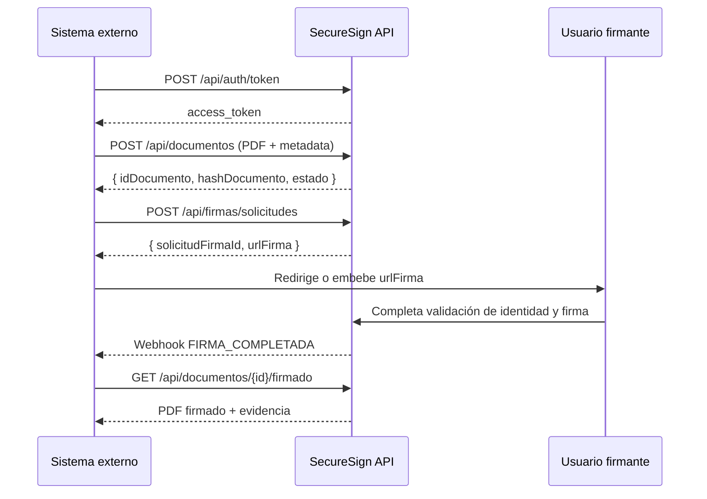

# Manual de Integración — SecureSign API Platform

## Capítulo 1 — Introducción

SecureSign API Platform es la capa de integración de SecureSign Perú, diseñada bajo el principio **API-first**: toda funcionalidad disponible en el portal web existe primero como API REST versionada. Este manual está dirigido a equipos técnicos de sistemas ERP, de Gestión Documental (SGD), RRHH, judiciales, educativos o financieros que deseen incorporar firma electrónica/digital sin exponer al usuario final un proveedor externo (ver arquitectura White Label, `docs/06-white-label`).

**Objetivo**: que un desarrollador integre el flujo completo (autenticación → registro de documento → solicitud de firma → seguimiento → descarga → validación pública) en menos de un día usando la documentación y los ejemplos de este manual.

## Capítulo 2 — Requisitos técnicos

- **URLs base**:
  - Producción: `https://api.securesign.pe/v1`
  - Sandbox: `https://sandbox-api.securesign.pe/v1`
  - Verificación pública: `https://verificar.securesign.pe`
  - Portal de desarrolladores: `https://developer.securesign.pe`
- **Certificados**: TLS 1.3 obligatorio; se recomienda *certificate pinning* en integraciones móviles.
- **Puertos**: 443 únicamente (HTTPS). No se exponen puertos alternativos en producción.
- **Seguridad de red**: si el cliente integrador requiere restricción por IP de origen, puede configurarse una allowlist adicional a nivel de `ClienteIntegrador` (contactar soporte Empresarial/Gobierno).

## Capítulo 3 — Autenticación

### OAuth2 (Client Credentials) — para llamadas servidor-a-servidor

```http
POST /api/auth/token
Content-Type: application/x-www-form-urlencoded

grant_type=client_credentials&client_id={ClientId}&client_secret={ClientSecret}&scope=firmas.crear documentos.leer
```

Respuesta:
```json
{
  "access_token": "eyJhbGciOiJSUzI1NiIsInR5cCI6IkpXVCJ...",
  "token_type": "Bearer",
  "expires_in": 3600,
  "scope": "firmas.crear documentos.leer"
}
```

### JWT

El `access_token` es un JWT firmado (RS256) cuyo `sub` identifica al `ClienteIntegrador` y cuyo `tenant` identifica la organización. Todos los endpoints de negocio requieren `Authorization: Bearer {access_token}`.

### API Keys

Para operaciones de solo lectura de bajo riesgo (p. ej., consulta de estado desde un webhook receptor), se admite adicionalmente una `X-Api-Key` de alcance restringido, nunca como sustituto de OAuth2 para operaciones de escritura.

> **Nunca** exponer `ClientSecret` en código de frontend/móvil. La autenticación OAuth2 debe ejecutarse siempre desde el backend del sistema integrador.

## Capítulo 4 — Proceso completo de integración



## Capítulo 5 — Catálogo de API

### 5.1 Registro documental
```http
POST /api/documentos
Authorization: Bearer {token}
Content-Type: multipart/form-data

archivo: contrato.pdf
codigoExterno: "EXP-2026-00123"
usuarioSolicitanteId: "..."
metadata: { "area": "RRHH", "tipo": "ContratoLaboral" }
```
Respuesta `201 Created`:
```json
{ "idDocumento": "b3f1...", "hashDocumento": "a94a8fe5...", "estado": "Registrado" }
```

### 5.2 Crear solicitud de firma
```http
POST /api/firmas/solicitudes
Authorization: Bearer {token}
Content-Type: application/json

{
  "documentoId": "b3f1...",
  "tipoFirma": "Avanzada",
  "requiereOrdenSecuencial": true,
  "firmantes": [
    { "nombre": "Ana Pérez", "documentoIdentidad": "DNI:12345678", "correo": "ana@empresa.com", "orden": 1 },
    { "nombre": "Luis Gómez", "documentoIdentidad": "DNI:87654321", "correo": "luis@empresa.com", "orden": 2 }
  ]
}
```
Respuesta `201 Created`:
```json
{ "solicitudFirmaId": "9c2e...", "urlFirma": "https://firma.empresa.com/f/9c2e...", "codigoVerificacionPublico": "K3PQ7X2A1F" }
```

### 5.3 Consultar estado
```http
GET /api/firmas/{id}/estado
```
```json
{ "estado": "Firmado", "firmantes": [ { "nombre": "Ana Pérez", "estado": "Firmado" }, { "nombre": "Luis Gómez", "estado": "Pendiente" } ] }
```
Valores posibles de `estado`: `Pendiente`, `Visualizado`, `ValidandoIdentidad`, `Firmado`, `Rechazado`, `Cancelado`, `Expirado`.

### 5.4 Descargar documento firmado
```http
GET /api/documentos/{id}/firmado
```
Devuelve el PDF firmado (con firma embebida PAdES cuando el tipo es Digital) más un encabezado `X-Evidencia-Url` apuntando al certificado de evidencia en PDF.

### 5.5 Validación pública
```http
GET /api/validacion/{codigo}
```
```json
{
  "documentoValido": true,
  "documento": "contrato.pdf",
  "hash": "a94a8fe5...",
  "firmantes": [ { "nombre": "Ana Pérez", "firmadoEn": "2026-08-02T14:03:00Z" } ],
  "cadenaConfianza": "Verificada"
}
```

### 5.6 Webhooks
El sistema integrador registra una URL de callback en su configuración de `ClienteIntegrador`. Eventos disponibles: `DOCUMENTO_CREADO`, `DOCUMENTO_ENVIADO`, `USUARIO_FIRMADO`, `FIRMA_COMPLETADA`, `FIRMA_RECHAZADA`.

```http
POST https://cliente.com/webhook/firma
Content-Type: application/json
X-SecureSign-Signature: sha256=...   <!-- HMAC del payload con el ClientSecret, para verificar autenticidad -->

{ "evento": "FIRMA_COMPLETADA", "documentoId": "b3f1...", "solicitudFirmaId": "9c2e...", "fecha": "2026-09-11T10:00:00Z" }
```
**Importante**: todo receptor de webhook debe validar `X-SecureSign-Signature` antes de procesar el payload, para evitar aceptar eventos falsificados.

## Capítulo 6 — Manejo de errores

| Código | Significado | Acción recomendada |
|---|---|---|
| 200 OK | Operación exitosa | — |
| 400 Bad Request | Payload inválido (falta campo, formato incorrecto) | Revisar el detalle en `errors[]` de la respuesta |
| 401 Unauthorized | Token ausente, expirado o inválido | Renovar token vía `/api/auth/token` |
| 403 Forbidden | Token válido pero sin el scope/permiso requerido | Verificar permisos concedidos al `ClienteIntegrador` |
| 404 Not Found | Recurso inexistente o no perteneciente al tenant del token | Verificar el id y que corresponde al mismo tenant |
| 409 Conflict | Estado incompatible con la operación (p. ej., firmar una solicitud ya cancelada) | Consultar estado actual antes de reintentar |
| 429 Too Many Requests | Límite de tasa excedido | Aplicar backoff exponencial; revisar cuota del plan |
| 500 Internal Server Error | Error no controlado del lado de SecureSign | Reintentar con backoff; reportar a soporte si persiste |

Todas las respuestas de error siguen el formato:
```json
{ "error": "SOLICITUD_INVALIDA", "mensaje": "El campo 'documentoId' es requerido", "traceId": "..." }
```

## Capítulo 7 — Buenas prácticas

1. Nunca almacenar `ClientSecret` en frontend, repositorios de código o logs.
2. Implementar reintentos idempotentes: usar `codigoExterno` para evitar duplicar documentos ante reintentos de red.
3. Validar siempre la firma HMAC de los webhooks antes de actualizar el expediente propio.
4. Usar el ambiente Sandbox (`developer.securesign.pe`) para pruebas de integración antes de solicitar credenciales de producción.
5. Suscribirse solo a los eventos de webhook realmente necesarios, para reducir carga operativa de ambos lados.
6. Cachear el `access_token` hasta su expiración (`expires_in`) en lugar de solicitarlo en cada llamada.

## Ejemplos de código

**.NET**
```csharp
var client = new SecureSignClient(apiKey: config["SecureSign:ApiKey"], tenant: "empresa-xyz");
var documento = await client.Documentos.RegistrarAsync(rutaArchivo: "contrato.pdf", codigoExterno: "EXP-2026-00123");
var solicitud = await client.Firmas.CrearSolicitudAsync(new SolicitudFirmaRequest {
    DocumentoId = documento.IdDocumento,
    TipoFirma = TipoFirma.Avanzada,
    Firmantes = new[] { new Firmante("Ana Pérez", "12345678", "ana@empresa.com", orden: 1) }
});
Console.WriteLine(solicitud.UrlFirma);
```

**JavaScript**
```javascript
const client = new SecureSignClient({ apiKey: process.env.SECURESIGN_API_KEY, tenant: "empresa-xyz" });
const documento = await client.documentos.registrar({ archivo: fs.createReadStream("contrato.pdf"), codigoExterno: "EXP-2026-00123" });
const solicitud = await client.firmas.crearSolicitud({
  documentoId: documento.idDocumento,
  tipoFirma: "Avanzada",
  firmantes: [{ nombre: "Ana Pérez", documentoIdentidad: "DNI:12345678", correo: "ana@empresa.com", orden: 1 }]
});
console.log(solicitud.urlFirma);
```

**Python**
```python
client = SecureSignClient(api_key=os.environ["SECURESIGN_API_KEY"], tenant="empresa-xyz")
documento = client.documentos.registrar(archivo="contrato.pdf", codigo_externo="EXP-2026-00123")
solicitud = client.firmas.crear_solicitud(
    documento_id=documento.id_documento,
    tipo_firma="Avanzada",
    firmantes=[{"nombre": "Ana Pérez", "documento_identidad": "DNI:12345678", "correo": "ana@empresa.com", "orden": 1}],
)
print(solicitud.url_firma)
```
