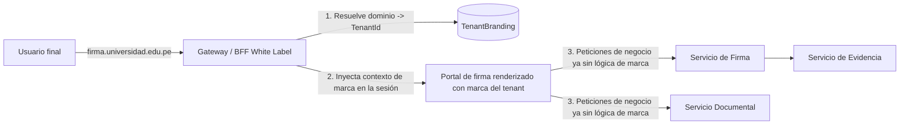

# Arquitectura White Label — Firma Embebida Multi-institucional

## 1. Objetivo

Permitir que un sistema externo (SGD gubernamental, portal universitario, ERP empresarial) ofrezca firma electrónica **bajo su propia identidad institucional**, sin que el usuario final perciba que existe un proveedor externo, preservando al mismo tiempo la seguridad criptográfica, la evidencia probatoria y la trazabilidad centralizada que gestiona SecureSign Perú.

## 2. Principio arquitectónico: BFF de resolución de marca en el borde

Ningún microservicio de dominio (Firma, Documentos, Evidencia, Certificados) conoce el concepto de "marca" o "tenant visual". La resolución de identidad visual ocurre **una sola vez, en el borde**, antes de que la petición llegue a los servicios de dominio:



Esto es lo que permite que el mismo backend de dominio sirva simultáneamente a una universidad, un municipio y una empresa privada sin ramificación de código por cliente — la marca es **configuración de borde**, no lógica de negocio.

## 3. Resolución de dominio personalizado

1. El cliente integrador configura un **CNAME** (`firma.entidad.gob.pe` → `edge.securesign.pe`).
2. SecureSign Perú provisiona automáticamente un certificado TLS para ese dominio (ACME / Let's Encrypt o CA gestionada, según el plan) mediante un proceso de emisión bajo demanda en el Gateway.
3. El Gateway resuelve, por cabecera `Host`, el `TenantId` correspondiente y carga `TenantBranding` desde caché (Redis) antes de servir cualquier página o respuesta de API.
4. Fallback: si no hay dominio personalizado configurado, se usa `https://firma.securesign.pe/t/{tenant-slug}`.

## 4. Personalización disponible por organización

| Elemento | Alcance |
|---|---|
| Logo, colores primario/secundario | Portal de firma, correos, certificado de evidencia PDF |
| Nombre mostrado | Reemplaza "SecureSign" por el nombre de la institución en toda la experiencia visible al firmante |
| Dominio personalizado | CNAME + TLS automático |
| Plantillas de correo/SMS | Editor de plantillas con variables (`{{nombreFirmante}}`, `{{nombreDocumento}}`, `{{enlaceFirma}}`) |
| Textos legales / avisos de privacidad | Configurable por tenant, versionado (para poder probar qué versión aceptó cada firmante) |
| Flujo de aprobación | Orden de firmantes, reglas de escalamiento, mensajes intermedios |

Todo esto vive en `TenantBranding` (ver [`../01-arquitectura/modelo-datos.md`](../01-arquitectura/modelo-datos.md)) y se resuelve en el "Motor de plantillas / Constructor de experiencia de firma" del BFF, nunca en los servicios de dominio.

## 5. Modos de integración (de menor a mayor control)

### 5.1 Redirección segura
El sistema externo crea la solicitud vía API y recibe una `UrlFirma` de un solo uso, con token de corta duración, a la que redirige al usuario. Más simple de integrar, adecuado para sistemas con poca capacidad de front-end.

### 5.2 iframe seguro embebido
```html
<iframe
  src="https://firma.entidad.gob.pe/embed/documento/{token}"
  sandbox="allow-forms allow-scripts allow-same-origin"
  referrerpolicy="strict-origin">
</iframe>
```
Requiere que el dominio embebedor esté en la allowlist CORS/`frame-ancestors` del `ClienteIntegrador` (ver seguridad, sección 7). El iframe corre bajo el dominio personalizado del tenant, reforzando la percepción de "marca propia".

### 5.3 SDK JavaScript embebido (mayor integración visual)
```javascript
SecureSign.open({
  documentoToken: "eyJhbGciOi...",
  tenant: "universidad-xyz",
  onFirmado: (evento) => actualizarExpediente(evento.documentoId),
  onRechazado: (evento) => notificarRechazo(evento.motivo)
});
```
El SDK monta un componente aislado (Shadow DOM) para evitar colisión de estilos con el sitio anfitrión, y se comunica con el backend por `postMessage` + token de sesión de corta duración — nunca expone credenciales de la aplicación integradora en el navegador del usuario final (esas permanecen en el backend del sistema externo, ver manual de integración).

## 6. Aislamiento multi-tenant + White Label combinados

- `TenantId` aísla **datos**.
- `TenantBranding` aísla **presentación**.
- `ClienteIntegrador` (con su `ClientId`/`ClientSecret`) aísla **capacidades de API** dentro de un tenant — un mismo tenant (p. ej., una universidad grande) puede tener varios sistemas integradores (portal de alumnos, sistema de RRHH interno) con permisos distintos, todos bajo el mismo branding institucional.

## 7. Seguridad específica del modelo White Label

- **Tokens temporales de un solo uso** para `UrlFirma` (expiración corta, uso único, ligados a IP/dispositivo de primer uso para detectar reenvío indebido).
- **Validación de origen estricta**: `frame-ancestors` y CORS configurados explícitamente por `ClienteIntegrador.OrigenesPermitidos`, nunca wildcard en producción.
- **Auditoría de integración**: toda petición autenticada con `ClientId` queda registrada en `ConsumoApi` y genera eventos de auditoría atribuibles al sistema integrador, no solo al usuario final — esto es clave para que una institución pueda auditar "qué hizo su propio sistema" a través de la plataforma.
- **Control de sesiones embebidas**: el iframe/SDK nunca recibe el `ClientSecret`; solo un token de sesión de firma de corta duración generado server-to-server por el backend del sistema integrador.

## 8. Casos de uso ilustrativos

**Universidad**: el alumno solicita un certificado de estudios desde el portal académico (su propio dominio); el sistema académico llama a la API de SecureSign para generar el documento y la solicitud de firma de la autoridad competente; la autoridad firma desde su propio correo institucional (enlace con branding de la universidad); el alumno descarga el documento firmado sin haber visto en ningún momento el nombre "SecureSign".

**Entidad pública (SGD)**: el expediente se genera en el sistema de gestión documental municipal; se envía a firma del funcionario competente vía API; el funcionario firma desde `firma.municipalidad.gob.pe`; el documento firmado y su evidencia regresan automáticamente al expediente electrónico original mediante webhook.

**Empresa privada (contrato laboral)**: el ERP de RRHH genera el contrato; se solicita firma del colaborador y luego del representante legal (orden secuencial); ambas firmas ocurren dentro de la experiencia visual del ERP vía SDK embebido; la validación final se realiza vía `verificar.securesign.pe` si un tercero (p. ej., SUNAFIL) necesita comprobar la validez del contrato.
