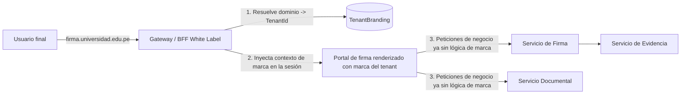

# Arquitectura White Label — Firma Embebida Multi-institucional

> ⚠️ **Este documento describe una arquitectura OBJETIVO casi enteramente NO CONSTRUIDA** — auditado contra el código el 2026-09-16. De todo lo descrito abajo, **lo único real hoy es el aislamiento de datos por `TenantId`** (`TenantContext`, derivado de claims JWT firmados, propagado en ~90 archivos de todos los servicios de dominio — esa parte sí es sólida). Todo lo demás — BFF, resolución de dominio/CNAME, TLS automático, `TenantBranding`, plantillas de correo, iframe/SDK embebido, webhooks, `ConsumoApi`, CORS por `ClienteIntegrador` — es diseño, no código. `GeneradorUrlFirmaWhiteLabel` (la única clase con ese nombre en el repositorio) existe pero es un stub que su propio comentario llama "implementación de referencia": siempre devuelve la misma URL genérica (`https://firma.securesign.pe/t/{tenantId}/f/{token}`), nunca resuelve un dominio personalizado. `ClienteIntegrador` tampoco existe como entidad — el estand-in real, `ClienteDemo`, trae su propio comentario señalando que reemplaza al "futuro Servicio de Tenancy/Integraciones... todavía no implementado". Leer este documento como un plan de producto, no como un inventario de lo que corre hoy — para eso, ver `src/backend/README.md` y `src/backend/RUNBOOK.md`.

## 1. Objetivo

Permitir que un sistema externo (SGD gubernamental, portal universitario, ERP empresarial) ofrezca firma electrónica **bajo su propia identidad institucional**, sin que el usuario final perciba que existe un proveedor externo, preservando al mismo tiempo la seguridad criptográfica, la evidencia probatoria y la trazabilidad centralizada que gestiona SecureSign Perú.

## 2. Principio arquitectónico: BFF de resolución de marca en el borde `[objetivo — no construido]`

Ningún microservicio de dominio (Firma, Documentos, Evidencia, Certificados) conoce el concepto de "marca" o "tenant visual". La resolución de identidad visual ocurre **una sola vez, en el borde**, antes de que la petición llegue a los servicios de dominio:



Esto es lo que permite que el mismo backend de dominio sirva simultáneamente a una universidad, un municipio y una empresa privada sin ramificación de código por cliente — la marca es **configuración de borde**, no lógica de negocio.

## 3. Resolución de dominio personalizado `[objetivo — no construido]`

No hay ningún código de resolución de dominio/host hoy — `GeneradorUrlFirmaWhiteLabel` siempre devuelve la misma URL genérica, nunca consulta un dominio personalizado. Diseño objetivo:

1. El cliente integrador configura un **CNAME** (`firma.entidad.gob.pe` → `edge.securesign.pe`).
2. SecureSign Perú provisiona automáticamente un certificado TLS para ese dominio (ACME / Let's Encrypt o CA gestionada, según el plan) mediante un proceso de emisión bajo demanda en el Gateway.
3. El Gateway resuelve, por cabecera `Host`, el `TenantId` correspondiente y carga `TenantBranding` desde caché (Redis) antes de servir cualquier página o respuesta de API.
4. Fallback: si no hay dominio personalizado configurado, se usa `https://firma.securesign.pe/t/{tenant-slug}`.

## 4. Personalización disponible por organización `[objetivo — no construido]`

| Elemento | Alcance |
|---|---|
| Logo, colores primario/secundario | Portal de firma, correos, certificado de evidencia PDF |
| Nombre mostrado | Reemplaza "SecureSign" por el nombre de la institución en toda la experiencia visible al firmante |
| Dominio personalizado | CNAME + TLS automático |
| Plantillas de correo/SMS | Editor de plantillas con variables (`{{nombreFirmante}}`, `{{nombreDocumento}}`, `{{enlaceFirma}}`) |
| Textos legales / avisos de privacidad | Configurable por tenant, versionado (para poder probar qué versión aceptó cada firmante) |
| Flujo de aprobación | Orden de firmantes, reglas de escalamiento, mensajes intermedios |

Todo esto vive en `TenantBranding` en el diseño objetivo (ver [`../01-arquitectura/modelo-datos.md`](../01-arquitectura/modelo-datos.md)) — pero `TenantBranding` no existe como entidad real hoy, solo como tabla en el `database/schema.sql` de referencia (que el propio README del backend aclara que "no es lo que corre realmente"). No hay ninguna entidad, migración, repositorio ni controlador para `TenantBranding`, ni ningún "Motor de plantillas" en el código.

## 5. Modos de integración (de menor a mayor control) `[objetivo — no construido]`

Ninguno de los tres modos de abajo existe hoy — ni siquiera un stub. No hay `/embed/...`, ni SDK JavaScript, ni `postMessage`, en ningún lugar del repositorio (`src/backend` ni `src/frontend`).

### 5.1 Redirección segura
El sistema externo crea la solicitud vía API y recibe una `UrlFirma` de un solo uso, con token de corta duración, a la que redirige al usuario. Más simple de integrar, adecuado para sistemas con poca capacidad de front-end.

### 5.2 iframe seguro embebido
```html
<iframe
  src="https://firma.entidad.gob.pe/embed/documento/{token}"
  sandbox="allow-forms allow-scripts allow-same-origin"
  referrerpolicy="strict-origin">
</iframe>
```
Requiere que el dominio embebedor esté en la allowlist CORS/`frame-ancestors` del `ClienteIntegrador` (ver seguridad, sección 7). El iframe corre bajo el dominio personalizado del tenant, reforzando la percepción de "marca propia".

### 5.3 SDK JavaScript embebido (mayor integración visual)
```javascript
SecureSign.open({
  documentoToken: "eyJhbGciOi...",
  tenant: "universidad-xyz",
  onFirmado: (evento) => actualizarExpediente(evento.documentoId),
  onRechazado: (evento) => notificarRechazo(evento.motivo)
});
```
El SDK monta un componente aislado (Shadow DOM) para evitar colisión de estilos con el sitio anfitrión, y se comunica con el backend por `postMessage` + token de sesión de corta duración — nunca expone credenciales de la aplicación integradora en el navegador del usuario final (esas permanecen en el backend del sistema externo, ver manual de integración).

## 6. Aislamiento multi-tenant + White Label combinados

- `TenantId` aísla **datos** — **esto es real y verificado** (ver banner al inicio de este documento).
- `TenantBranding` aísla **presentación** `[objetivo — no construido]`.
- `ClienteIntegrador` (con `ClientId`/`ClientSecret`) aísla **capacidades de API** dentro de un tenant `[parcial]` — el mecanismo `ClientId`/`ClientSecret`+`scopes` sí funciona end-to-end hoy (Argon2id-hasheado, RUNBOOK.md 12.23), pero contra un catálogo estático de demo (`ClientesDemo`), no una entidad `ClienteIntegrador` real ni un alta de autoservicio.

## 7. Seguridad específica del modelo White Label `[objetivo — no construido]`

Nada de esta sección existe hoy — no hay `UrlFirma` de un solo uso ligada a dispositivo, no hay `frame-ancestors`/CORS por cliente (el CORS real del Gateway hoy es una única política abierta de desarrollo), no hay tabla `ConsumoApi` con código detrás, y no hay iframe/SDK del cual proteger sesiones.

## 8. Casos de uso ilustrativos `[objetivo — no construido, incluye webhooks que tampoco existen]`

**Universidad**: el alumno solicita un certificado de estudios desde el portal académico (su propio dominio); el sistema académico llama a la API de SecureSign para generar el documento y la solicitud de firma de la autoridad competente; la autoridad firma desde su propio correo institucional (enlace con branding de la universidad); el alumno descarga el documento firmado sin haber visto en ningún momento el nombre "SecureSign".

**Entidad pública (SGD)**: el expediente se genera en el sistema de gestión documental municipal; se envía a firma del funcionario competente vía API; el funcionario firma desde `firma.municipalidad.gob.pe`; el documento firmado y su evidencia regresan automáticamente al expediente electrónico original mediante webhook.

**Empresa privada (contrato laboral)**: el ERP de RRHH genera el contrato; se solicita firma del colaborador y luego del representante legal (orden secuencial); ambas firmas ocurren dentro de la experiencia visual del ERP vía SDK embebido; la validación final se realiza vía `verificar.securesign.pe` si un tercero (p. ej., SUNAFIL) necesita comprobar la validez del contrato.
